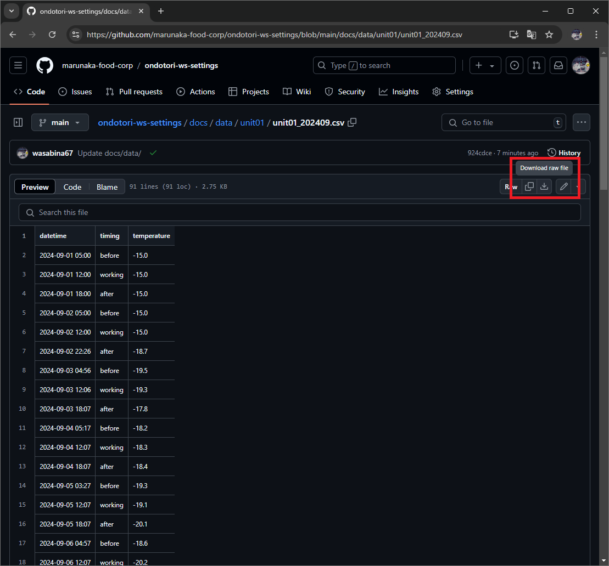

# 温度データについて

## 1. 確認方法

以下のURLから、子機ごとに温度データを確認できます。温度データは、月毎にCSV形式で保存されています。

- https://github.com/marunaka-food-corp/ondotori-ws-settings/tree/main/docs/data

```bash
data/
├── unit01
│   ├── unit01_202409.csv
│   └── unit01_202410.csv
├── unit02
│   ├── unit02_202409.csv
│   └── unit02_202410.csv
├── unit03
│   ├── unit03_202409.csv
│   └── unit03_202410.csv
├── unit04
...
```

## 2. ダウンロード方法

### 2-1. UIからダウンロードする



### 2-2. HTTP経由でダウンロードする

以下のように、「Unit名」「CSVファイル名」を指定して、CSVをダウンロードすることができます。

```
https://marunaka-food-corp.github.io/ondotori-ws-settings/data/{Unit名}/{CSVファイル名}
```

- 例 1
  - https://marunaka-food-corp.github.io/ondotori-ws-settings/data/unit01/unit01_202409.csv
- 例 2
  - https://marunaka-food-corp.github.io/ondotori-ws-settings/data/unit02/unit02_202409.csv
- 例 3
  - https://marunaka-food-corp.github.io/ondotori-ws-settings/data/unit02/unit02_202410.csv
